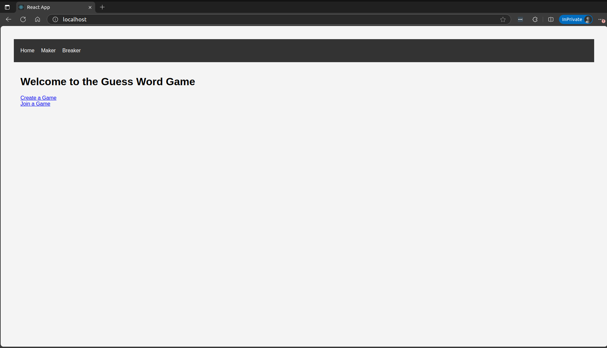
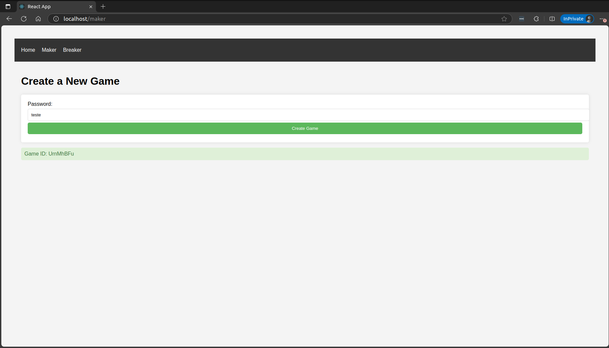
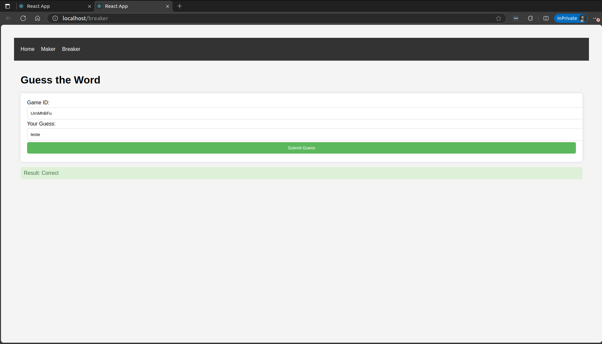

# GUESS_GAME no Docker

## Serviços utilizados
- Banco postgresql para persistência de dados.
- Backend em python utilizando Flask.
- Frontend com React.
- Nginx para proxy reverso e balanceamento de cardo do backend.

## Volumes
- No serviço do postgres, possui um mount de volume para persistir os dados no ambiente local. Caso os containers sejam reiniciados, os dados não serão perdidos.

## Redes
- Todos os serviços estão na mesma rede personalizada chamada bridge_network, permitindo que os containers se comuniquem entre si.

---
# Rodando localmente

## Requerimentos
- [Docker](https://docs.docker.com/engine/install/)

## Como iniciar a aplicação
1. Rode o comando abaixo para iniciar os serviços com o docker compose:\
``
docker compose up
``\
ou com o -d para iniciar os containers em background\
``
docker compose up -d
``\
Esse comando irá iniciar os containers do postgresql, o backend e o frontend. Caso não tenha as imagens localmente, o docker irá buscar no registry e fazer o download.

2. No browser, acesse a URL http://localhost/

    
    2.1 Clique no Maker, crie uma palavra secreta e clique em Create Game. Copie o Game ID.
    

    2.2 Clique em Breaker, cole o Game ID e adivinhe a palavra secreta.
    

## Como desligar a aplicação
1. Rode o comando abaixo para desligar os serviços com o docker compose:\
``
docker compose down
``

## Atualizar a aplicação
1. Caso altere alguma configuração na aplicação, rode o comando abaixo:\
``
docker compose up --build
``\
Isso irá fazer com que o build da imagem rode novamente pegando as novas atualizações que foram alteradas.